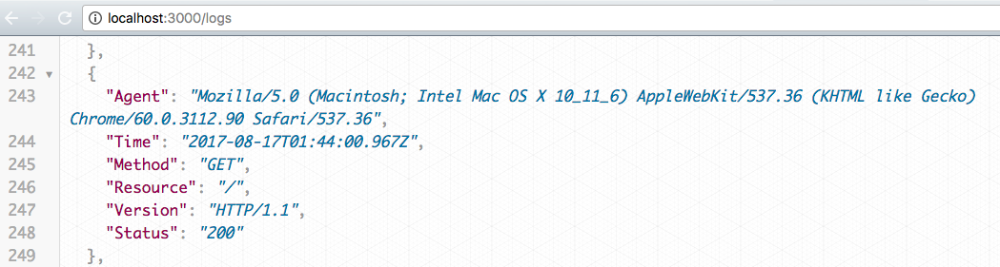

# Log All The Things
> Using node to build a logger with some practice transforming data.

This was my seventh project at Origin Code Academy. This logger was created using Node, Express, and the File System module from Node.



## Approach

In this project I built my own custom logger that logs some information about each request it recieves. I also expose an endpoint on the server so it will be easy for anyone to retieve the latest log data from the web.

## Installation

Download all associated files and load them up in your favorite text editor!

## Development setup

This app relies on NodeJS and Express for its functionality.

I recommend using [nodemon](https://www.npmjs.com/package/nodemon) to run this server.

```sh
npm install -g nodemon
// cd to-your-web-folder
nodemon server
```

## Contact Information

Twitter: [@adriftinthesea](https://twitter.com/adriftinthesea)

Email: z@zamarise.com

GitHub: [https://github.com/zamarise](https://github.com/zamarise/)
